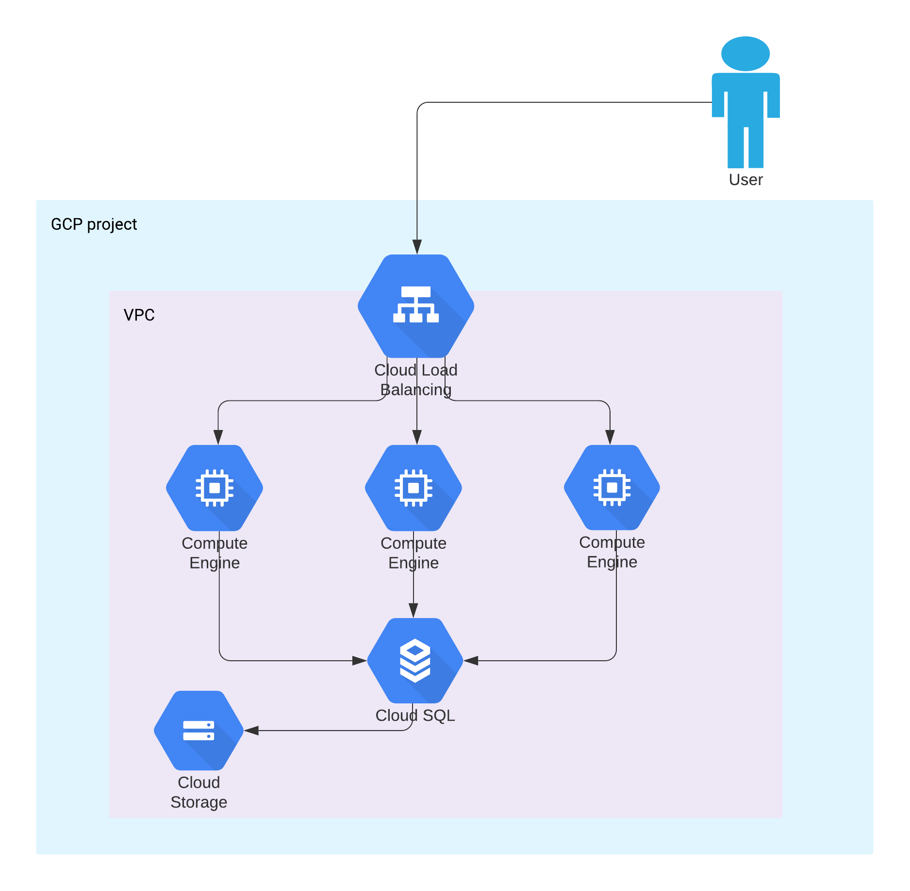

## Demo App

A sample IaC that deploys an app with three web nodes and a backend DB server.

For simplicity, SQL instance is running with public IP. 

**Do not do this is production!!**

## Architecture

## Running
Add your project id at the top of the `main.tf` file.

Use a service account that has compute admin role.

`terraform plan; terraform apply`